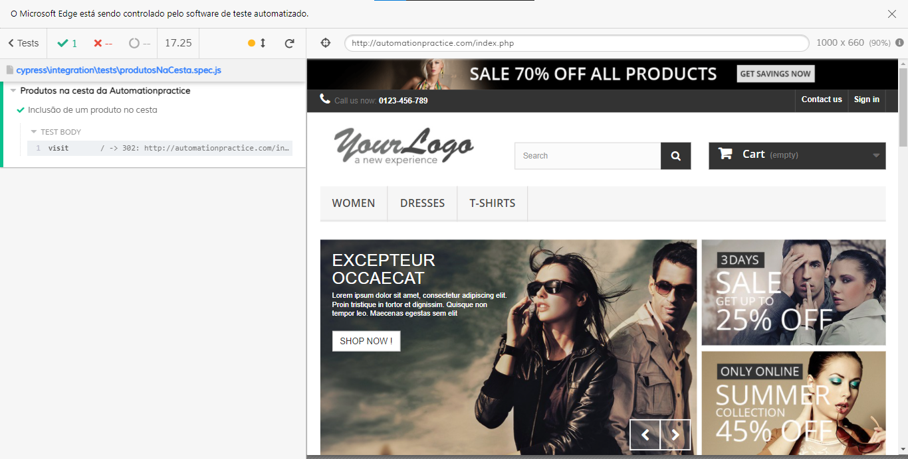

<h1 align="center">Projeto: DesafioQA utilizando Cypress </h1>
<p align="center">Repositório específico para realizar os testes do desafio de Analista de Testes da empresa [Paschoalotto](https://www.paschoalotto.com.br/).</p>

<p align="center"></p>

--------

## Configurando o Ambiente :gear:

- [Cypress.io](http://www.cypress.io)

- [Documentação Cypress](https://docs.cypress.io/guides/overview/why-cypress.html)

### Requisitos para instalação

- [Node.js](https://nodejs.org/en/)
- [Java 8 ou superrior caso use o Allure Report](https://javadl.oracle.com/webapps/download/AutoDL?BundleId=244036_89d678f2be164786b292527658ca1605)

### Instalação do NPM e instalação do Cypress

Na pasta do projeto abra o terminal ou no VSCode use o Ctrl + ' (aspas simples), e digite os comandos abaixo:

```shell
npm init -y
npm install --yes
npm install cypress@6.8.0 --save-dev
```

OBS: Instalação da versão 6.8.0 pois está bem estável. Outro motivo é que não verifiquei as mudanças das novas versões, com isso prefiro usar neste projeto esta versão do Cypress.

### Comandos para iniciar o Cypress :gear:

#### Iniciar o Cypress no navegador:

```shell
   npx cypress open
```

#### Para executar em modo headless:

```shell
   npx cypress run
```
-----
## Desafio
- A. Buscar três produtos em um site de compras da sua escolha
- B. Inserir o resultado em uma planilha
### Resultados obtidos no desafio

- Site de compras utilizado: [automationpractice.com](http://automationpractice.com/)

- Casos de teste criados: [Casos de teste](https://github.com/QuintilianoNery/DesafioQA/blob/origin/arquivos/casosDeTeste.txt)

- OBS: Como informado na documentaçã do cypress, o comando [cy.writeFile](https://docs.cypress.io/api/commands/writefile#Examples) para salvar as informações em um arquivo, só podem ser em dois formatos, txt e JSON, por este motivo a planilha ficou nesse formato exibido no link Resultados.csv
- Planilha com os resultados da compra: [Resultados.csv](https://github.com/QuintilianoNery/DesafioQA/blob/origin/cypress/fixtures/resultados.csv)

- Configuração e uso do Allure-Report: [Allure Report](https://github.com/QuintilianoNery/DesafioQA/blob/origin/arquivos/configuracaoAllure-Report.md)

- Relatório no github-pages, através de CI: [Github-pages CI](https://github.com/QuintilianoNery/DesafioQA/deployments/activity_log?environment=github-pages)

- Cypress dashboard: [Cypress dashboard](https://dashboard.cypress.io/projects/qu5dum/runs?branches=%5B%5D&committers=%5B%5D&flaky=%5B%5D&page=1&status=%5B%5D&tags=%5B%5D&timeRange=%7B%22startDate%22%3A%221970-01-01%22%2C%22endDate%22%3A%222038-01-19%22%7D)
